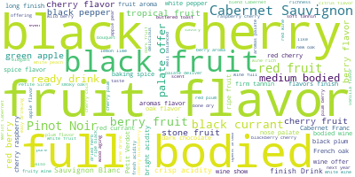

# Predict Price of Wine

> An in-class kaggle competition to predict the class of wine using numerical and categorical data and wine comments

This repository contains the machine learning algorithms I explored during the in-class kaggle competition for wine prediction.



## What was done

### Preprocessing

- Encoding categorical features using LabelEncoding. Some features has too many classes to use one-hot vectors
- Preprocessing of text into count vectors, tf-idf and LDA for topic extraction
- Feature extraction from other columns to form new features

### Modelling

- Random Forest Ensemble
- Xgboost with Early stopping and pruning
- Feedforward Neural Network

## Where to start

The `Wine_Prediction_Final` notebook contains a notebook report on the competition. Also, a presentation of our findings during the competition can be found in `WinePredictionPresentation.pdf`

For specific preprocessing notebooks, check the `Preprocesing-*.ipynb` notebooks.

Clone the repository by running the following in your terminal;

```bash
git clone https://github.com/ogunlao/wine_price_prediction.git
```

Enjoy.